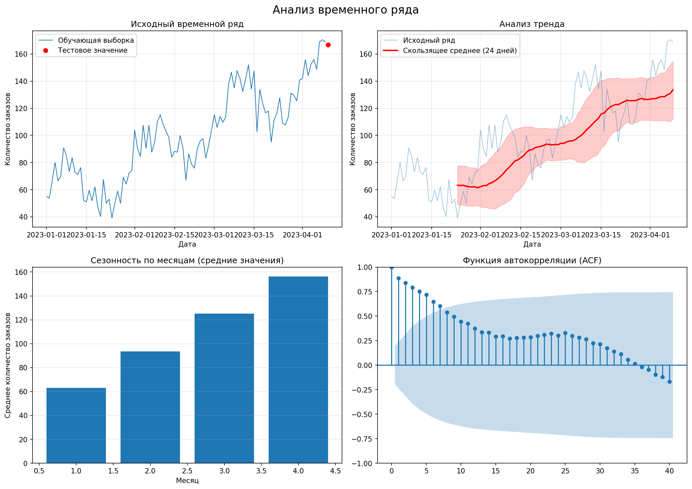
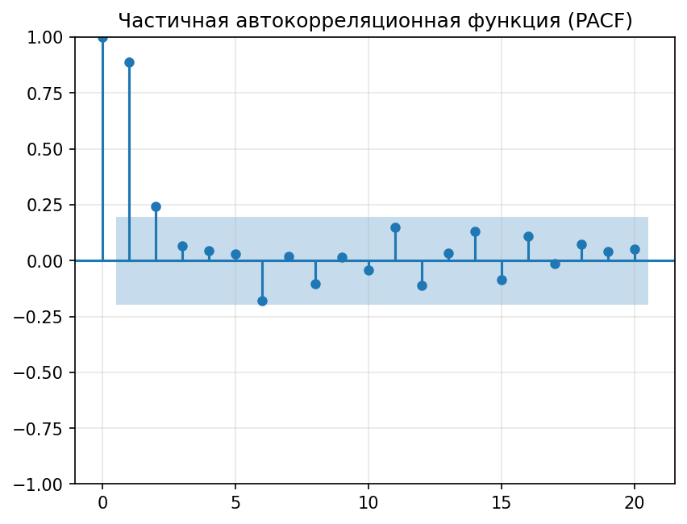
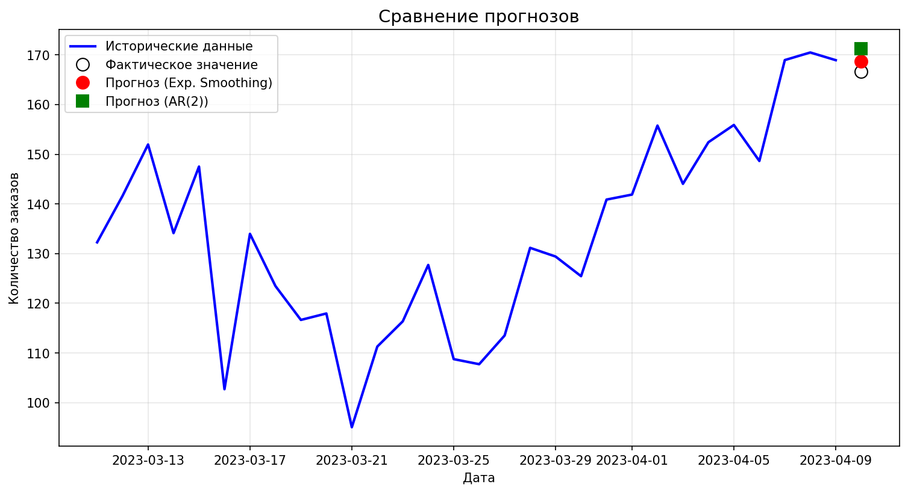

# Отчёт по лабораторной работе №6
## Прогнозирование временных рядов (AR-модель)

---

### 1. Цель работы
Прогнозирование товарооборота интернет-магазина книг с использованием методов анализа временных рядов: экспоненциального сглаживания и авторегрессионной модели (AR).

---

### 2. Исходные данные
- Датасет: `tovar_moving.csv`
- Период: [укажите период данных]
- Количество наблюдений: [укажите количество]
- Тестовое значение: [укажите значение]

---

### 3. Выполнение работы

#### 3.1. Подготовка данных
- Данные загружены и отсортированы по дате
- Временной ряд разделён на обучающую и тестовую выборки
- Последнее значение отложено для проверки прогноза

#### 3.2. Анализ временного ряда

**График 1: Исходный временной ряд**

**Наблюдения:**
  - [Опишите визуальные характеристики: тренд, сезонность, выбросы]
  - Среднее количество заказов: [значение]
  - Максимальное/минимальное значение: [значения]

**Тренд:**
  - Сила тренда (корреляция с временем): [значение]
  - Вывод: [есть/нет выраженный тренд]

**Сезонность:**
  - [Есть/нет] выраженная сезонная составляющая
  - Период сезонности: [если определён]

#### 3.3. Экспоненциальное сглаживание (α=0.7)
- Прогнозируемое значение: [значение]
- Фактическое значение: [значение]
- Абсолютная ошибка: [значение]
- Относительная ошибка: [значение]%

#### 3.4. Проверка на стационарность
**Результаты теста Дики-Фуллера:**
  - ADF статистика: [значение]
  - p-value: [значение]
  - Вывод: [ряд стационарен/нестационарен]

**Порядок интегрирования:**
  - d = [значение]

#### 3.5. Определение порядка AR модели
**Анализ PACF (график частичной автокорреляции):**

**Выводы:**
  - Значимые лаги: [перечислите]
  - Выбранный порядок модели: p = [значение]

#### 3.6. Построение AR модели
- Модель: AR([p])
- Коэффициенты модели:
  - Константа: [значение]
  - Lag 1: [значение]
  - Lag 2: [значение]...
- Прогнозируемое значение: [значение]
- Абсолютная ошибка: [значение]
- Относительная ошибка: [значение]%

#### 3.7. Сравнение результатов

| Метод | Прогноз | Факт | Абс. ошибка | Отн. ошибка |
|-------|---------|------|-------------|-------------|
| Эксп. сглаживание | [знач.] | [знач.] | [знач.] | [знач.]% |
| AR([p]) | [знач.] | [знач.] | [знач.] | [знач.]% |

---

### 4. Выводы

1. **Характеристики временного ряда:**
   - Ряд [стационарен/нестационарен]
   - [Есть/нет] выраженный тренд
   - [Есть/нет] сезонная составляющая

2. **Эффективность методов прогнозирования:**
   - Экспоненциальное сглаживание показало ошибку [значение]%
   - AR([p]) модель показала ошибку [значение]%
   - Лучший результат показал метод: [указать метод]

3. **Рекомендации для бизнеса:**
   - Для прогнозирования товарооборота рекомендуется использовать [метод]
   - Точность прогноза составляет примерно [значение]%
   - Для повышения точности можно: [рекомендации]

4. **Ограничения и дальнейшие исследования:**
   - [Укажите ограничения проведённого анализа]
   - Для улучшения прогноза можно рассмотреть модели: SARIMA, Prophet, LSTM
   - Рекомендуется увеличить объём данных для более точного анализа сезонности

---

### 5. Приложения
1. `lab4.py` - код выполнения работы
2. `results.csv` - таблица с результатами
3. `time_series_analysis.png` - анализ временного ряда
4. `pacf_plot.png` - график PACF
5. `forecast_comparison.png` - сравнение прогнозов