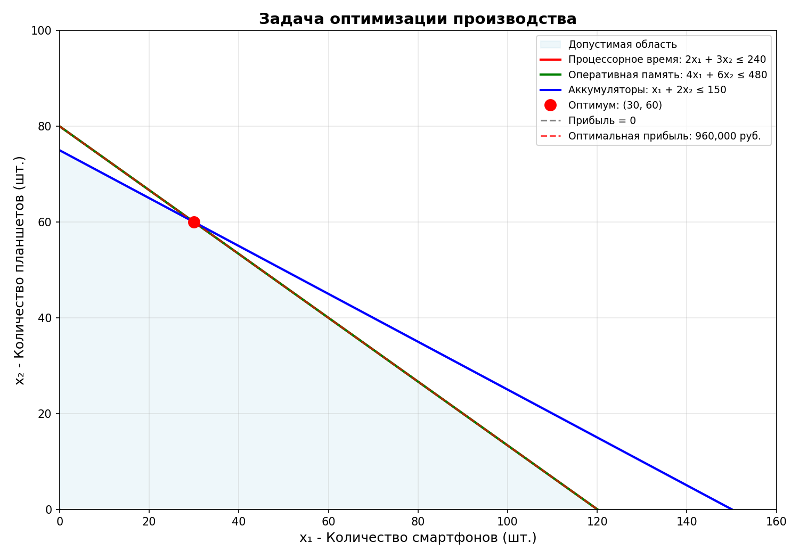
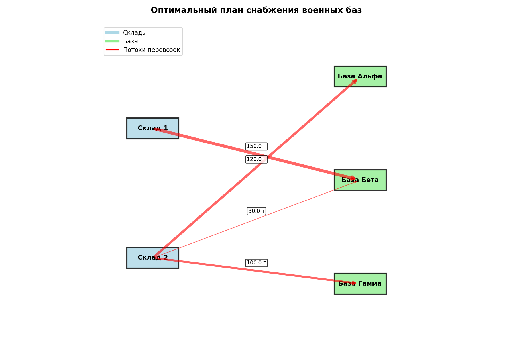

# Лабораторная работа
## Линейное программирование в задачах оптимизации

---

## Цель работы
Освоить практические навыки формализации и решения задач линейного программирования с использованием Python.

---

## 1. Задача 1: Оптимизация производства электроники

### 1.1 Математическая модель
**Переменные:**
- x₁ - количество производимых смартфонов
- x₂ - количество производимых планшетов

**Целевая функция:**  
P(x₁, x₂) = 8000x₁ + 12000x₂ → max

**Ограничения:**
1. Процессорное время: 2x₁ + 3x₂ ≤ 240
2. Оперативная память: 4x₁ + 6x₂ ≤ 480
3. Аккумуляторы: x₁ + 2x₂ ≤ 150
4. x₁ ≥ 0, x₂ ≥ 0

### 1.2 Результаты решения
- Оптимальное количество смартфонов: [значение] шт.
- Оптимальное количество планшетов: [значение] шт.
- Максимальная прибыль: [значение] руб.

### 1.3 Анализ использования ресурсов
| Ресурс | Использовано | Доступно | Загрузка | Статус |
|--------|--------------|----------|----------|--------|
| Процессорное время | ... | 240 ч | ...% | [активный/неактивный] |
| Оперативная память | ... | 480 ГБ | ...% | [активный/неактивный] |
| Аккумуляторы | ... | 150 шт | ...% | [активный/неактивный] |

### 1.4 Функция Лагранжа
L(x, µ) = -8000x₁ - 12000x₂ + µ₁(2x₁ + 3x₂ - 240) + µ₂(4x₁ + 6x₂ - 480) + µ₃(x₁ + 2x₂ - 150)

**Экономический смысл множителей Лагранжа µᵢ:**  
Теневая цена ресурса показывает, на сколько увеличится прибыль при увеличении запаса этого ресурса на единицу.

### 1.5 Визуализация

---

## 2. Задача 2: Оптимизация снабжения военных баз

### 2.1 Математическая модель
**Переменные:** xᵢⱼ - количество тонн от склада i к базе j

**Целевая функция:**  
Z = 8x₁₁ + 6x₁₂ + 10x₁₃ + 9x₂₁ + 7x₂₂ + 5x₂₃ → min

**Ограничения:**
- По складам: x₁₁ + x₁₂ + x₁₃ = 150, x₂₁ + x₂₂ + x₂₃ = 250
- По базам: x₁₁ + x₂₁ = 120, x₁₂ + x₂₂ = 180, x₁₃ + x₂₃ = 100
- xᵢⱼ ≥ 0

### 2.2 Проверка сбалансированности
- Общий запас: 150 + 250 = 400 тонн
- Общая потребность: 120 + 180 + 100 = 400 тонн
- ✓ Задача сбалансирована

### 2.3 Результаты решения
- Минимальная стоимость: [значение] усл. ед.

**Оптимальный план перевозок:**
| Маршрут | Количество (т) | Стоимость (усл. ед.) |
|---------|----------------|----------------------|
| Склад 1 → Альфа | ... | ... |
| Склад 1 → Бета | ... | ... |
| ... | ... | ... |

### 2.4 Функция Лагранжа
L = Z + λ₁(x₁₁ + x₁₂ + x₁₃ - 150) + λ₂(x₂₁ + x₂₂ + x₂₃ - 250) + ν₁(x₁₁ + x₂₁ - 120) + ν₂(x₁₂ + x₂₂ - 180) + ν₃(x₁₃ + x₂₃ - 100)

**Экономический смысл множителей:**
- λᵢ - потенциал склада (ценность дополнительной тонны на складе)
- νⱼ - потенциал базы (стоимость доставки дополнительной тонны)

### 2.5 Визуализация

---

## Выводы
1. Линейное программирование эффективно решает задачи оптимизации в бизнесе и логистике
2. Метод множителей Лагранжа позволяет анализировать чувствительность решения
3. Python-библиотеки (SciPy) предоставляют удобные инструменты для решения ЛП-задач
4. Визуализация помогает понять геометрическую интерпретацию задачи